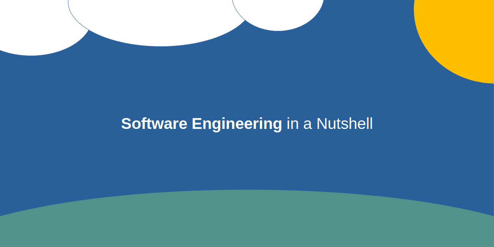

# Software Engineering Kurs

Dieses Repository enthält Materialien, die ich in meinem Kurs zum Thema "Software Engineering" verwende.
Dieser Kurs setzt voraus, dass die Teilnehmer*innen bereits mit den Grundlagen der Programmierung vertraut sind.
Auf dieser Grundlage vermittelt der Kurs, wie man vernünftig größere Softwaresysteme bauen kann.

## Namensräume

* `namespace <X>`
* `using <Y>`
* Projektnamen
* Ordnernamen

## Pakete

* Klassenbibliotheken (`.dll`)
* Konsolenanwendungen (`.exe`)
* Grafikanwendungen (`.exe`)
* NuGet (`.nupkg`, `.nuspec`)

## Frameworks

* Windows Forms (WinForms)
  * Designer Generated
  * Code Behind
* Windows Presentation Foundation (WPF)
  * XAML
* Multi-Platform App UI (MAUI)
  * Seitenstapel

## Entwurfsmuster

* Singleton
* Adapter
* Proxy
* Compsite
* Observer
* Visitor

## Architekturmuster

* Monolith
* Schichten
* Eregnisgetrieben
* Dienstorientiert
* Verteilt
* Skalierbar